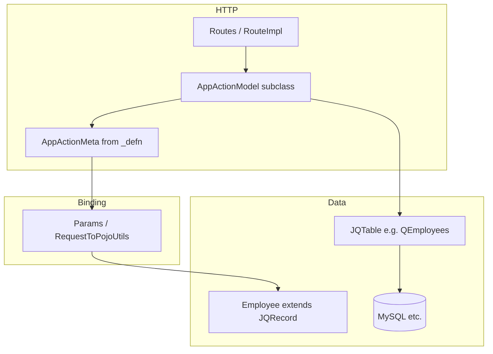

# Chargebee App Framework — LLM Overview
**Pre-requisites:** **Please do read these documents to get a better understanding :** [ActionMeta-LLM.md](./ActionMeta-LLM.md) ,[ActionModel-LLM.md](./ActionModel-LLM.md) ,[AppActionMeta-LLM.md](./AppActionMeta-LLM.md) ,[AppActionModel-LLM.md](./AppActionModel-LLM.md) ,[chargebee_framework_CRUD_operation_good&bad_practices.md](./chargebee_framework_CRUD_operation_good&bad_practices.md) ,[table-defn-complete-guide](../table/TblDefn-Complete-Guide.md),[table-end-guide](../table/complete-table-defn-workflow.md),[table-defining-guide](../table/table-defn-best-practices.md),[table-guide](../table/table-defn-starter.md),[table-guide-2](../table/table-defn-complete-guide.md).

Use this document as a **checklist**: prefer **Good** patterns; **Bad** patterns are common sources of bugs, failed `gen-routes`, or security issues,these documents contains all information about the functions used for creating an END to END webapp.

**Goal:** After reading this, an LLM should know *where* things live, *how* data and HTTP actions flow, and *what* to open next for detail.


---

## 1. Repository shape (this codebase)

| Area | Role |
|------|------|
| `cb-app/src/` | Main Java application: config, actions, models, web |
| `appbuild/` | Ant targets: compile, **gen-routes**, tests, full `chargebee` build |
| `db/` | SQL schema and migration inputs used by metamodel / tooling |

Large parts of the **web framework** live in **dependencies** (JARs), not as source in this tree. App code **imports** them, e.g.:

- `com.chargebee.framework.web.*` — routing, HTTP, `ActionMeta`, forwards
- `com.chargebee.framework.metamodel.*` — tables, columns, module definitions
- `com.chargebee.framework.jooq.*` — SQL helpers (`SqlUtils`, jOOQ integration)

The **app layer** adds:

- `com.chargebee.app.AppActionModel` — base class for most HTTP “actions”
- `com.chargebee.app.AppActionMeta` — app-specific meta DSL on top of framework `ActionMeta`
- `com.chargebee.app.config.Defns` — central **module definition** (which tables exist, schema dirs, etc.)

---

## 2. Mental model: from HTTP to database



1. **Router** selects an action class (often registered in `Routes.java`).
2. **`_defn(AppActionMeta m)`** on that class declares path, method, roles, params, optional `$model` / `$create`, etc.
3. Framework **binds** the request into params (and optionally into table-backed models).
4. **`callLogic()`** (or overridden lifecycle) runs your code, typically using **`Tables.q*`** (`JQTable` instances) and **model POJOs** (`dbInsert`, `dbFetchOne`, …).

### HTTP method: where inputs live (GET vs POST)

- **GET** (`m.$method(HttpMethod.get)`): There is **no** conventional request **body**. Clients usually send parameters in the **query string** (and sometimes in **path segments** the route parses). Do not rely on JSON or form **body** for GET — tools often omit it entirely.
- **POST** (`m.$method(HttpMethod.post)`): Typical browser actions use **`application/x-www-form-urlencoded`** or **`multipart/form-data`**; the servlet stack reads those fields as **request parameters**, and declared **`m.$param(...)`** values bind from the **body** (and from the query string if present). **Bulk / table-backed** shapes often use **bracketed keys** (e.g. `students[1].first_name`) in that body. Some actions use **JSON request bodies** with helpers like **`getRequestBody(...)`** — that path is separate from classic form **`$param`** binding; mirror an existing action of the same style.
- **Bad:** Testing GET with **`-d` / JSON body**; or POSTing **only** query params when the **`_defn`** expects **form** field names the binder generates for **`$create`/`$list`**.

More detail: embedded **§2.0** below and **[chargebee-framework-practices-LLM.md](./chargebee-framework-practices-LLM.md)**.

---

## 3. Module and table definitions (`Defns`, `*Defn`)

### `Defns`

- Class: `com.chargebee.app.config.Defns`
- Extends **`ModuleDefn`** (framework).
- **`getTableDefns()`** returns an ordered array of `*Defn.class` entries.

**Critical comment in source:** table defn classes run in **declaration order**; dependencies are **not** auto-sorted. If table B references table A (FK), **A’s defn must appear before B’s** in the array (e.g. `ManagerDefn` before `EmployeeDefn` when employees reference managers).

### `*Defn` classes

- Implement **`TblDefn`** (framework).
- Define one or more tables via **`AppTable`** DSL methods such as:

    - `$id().$auto()`
    - `$siteSegFK(true)` — site-scoped tenant data
    - `$string("name").$maxChars(n)`
    - **`$email()`** / **`$email("col")`** — **email** columns (prefer over **`$string("email").$maxChars(255)`** for address fields)
    - `$fk("other_table").$dbColName("x_id").$nullable(true)`

- Codegen / tooling consumes these to generate or update:

    - `cb-app/src/com/chargebee/app/models/` — concrete `Employee`, `Manager`, …
    - `cb-app/src/com/chargebee/app/models/meta/QEmployees.java` — **`JQTable`** accessors
    - `cb-app/src/com/chargebee/app/models/Tables.java` — **`qemployees`**, join helpers like `qemployees_using_qmanagers`
    - `db/schema.sql` (when schema generation is part of your workflow)

**LLM takeaway:** New persistent entity = new `XDefn` + register in `Defns.getTableDefns()` in the **right order**, then run the appropriate **gen/compile** steps (team convention).

---

## 4. Actions (`AppActionModel`)

### Conventions

- Package: commonly `com.chargebee.app.<feature>.actions`
- Class: `public class FooAction extends AppActionModel<FooAction>`
- **Metadata:** `void _defn(AppActionMeta m) { ... }`
- **Entry logic:** `@Override public Forward callLogic() throws Exception`

### Typical `_defn` ingredients

- **`m.$path("/...")`** — URL path (exact conventions depend on route store).
- **`m.$method(HttpMethod.get|post|...)`**
- **`m.$roles(AppRole....)`** — authorization (**derive from RBAC**, not from unrelated doc snippets — **[AppActionMeta-LLM.md §0](./AppActionMeta-LLM.md)**)
- **`m.$param(...)`** — request inputs (strings, longs, or **column-backed** params)
- **`m.$tab(...)`** — admin **left-nav** context (**optional** for JSON-only APIs); values must match **product IA**, not doc defaults — see **[AppActionMeta-LLM.md §0.1](./AppActionMeta-LLM.md)**
- **`m.$moduleDefn(Defns.class)`** — ties the action to the app module; **often required for route/meta generation** when the action does not open a primary `$model` (see practices doc).
- **`m.$create(m.$model(qtable))) { m.$param(qtable.col); }`** — “create” flow with bound columns
- **`m.$ajaxPrecheck(true|false)`** — CSRF/ajax behavior for browser clients

**GET vs POST:** Match **`m.$method(...)`** to how the client sends data — **query/path for GET**; **form body (or project-standard JSON) for POST** when persisting or sending large inputs. See **§2 (mental model)** and practices **§2.0**.

### Runtime helpers (conceptual)

Action subclasses usually inherit methods such as:

- `getLong("id")`, `getString("name")`, … — backed by **`$param`** definitions
- `get(qemployees)` — retrieve bound **`Employee`** after `$create`/`$model`
- `currentSite()` — tenant **Site** context
- `sendJsonResponseNoAjaxCheck(JSONObject)`, `sendAjaxResponse(...)` — JSON HTTP responses

Exact APIs live on **`AppActionModel`** in the framework JAR.

---

## 5. Routing (`Routes.java`, `gen-routes`)

- **`cb-app/src/com/chargebee/app/configweb/Routes.java`** is the large route registration file.
- **`gen-routes`** (Ant target in `appbuild/build.xml`) regenerates or updates route entries from compiled action classes / metadata.
- **Order of operations (typical):** compile action classes first (**`compile-app`** or equivalent), then **`gen-routes`**. Running `gen-routes` on stale or missing `.class` files leads to missing routes or failures.

Routes group related endpoints (e.g. under a feature block). The **string path** in `_defn` must stay consistent with what the route store expects.

---

## 6. Data access (`Tables`, `JQTable`, models)
**Please go through these first:** [table-guide1](../table/complete-table-defn-workflow.md),[table-guide2](../table/table-defn-best-practices.md),[table-guide3](../table/table-defn-complete-guide.md),[table-guide4](../table/table-defn-starter.md),[table-guide5](../table/TblDefn-Complete-Guide.md)

### `Tables`

- Static hub: `import static com.chargebee.app.models.Tables.qemployees;`
- Exposes **`QEmployees`**, **`QManagers`**, and **FK join descriptors** (e.g. `qemployees_using_qmanagers`) used with jOOQ-style queries.

### `JQTable` / `Q*`

- **`dbFetchOne(id)`**, **`dbFetchList(condition)`**, **`dbDelete`**, inserts via model **`dbInsert()`**, etc.
- Conditions built from columns: e.g. `qemployees.manager_id.equal(x)`.

### Models

- **`Employee extends EmployeeBase extends JQRecord<Employee,QEmployees>`**
- Hold column state; **`siteId(...)`**, **`firstName(...)`**, getters/setters generated from defn.

### Multi-tenancy

- Many tables use **`site_id`** (via `$siteSegFK(true)` or explicit FK). **Good actions** scope reads/writes to **`currentSite()`** (or explicit site checks) so one tenant cannot access another’s rows.

---

## 7. Build pipeline (simplified)

From `appbuild/build.xml`, a full dev build often chains steps such as:

- `compile-app-models` / model-related generation
- `compile-app` — compile application **including** `*Action.java`
- **`gen-routes`** — refresh `Routes.java` (or route metadata)
- Other codegen: `gen-enums`, `gen-api-meta`, etc.

**LLM rule:** After adding or changing **`_defn`**, assume **compile + gen-routes** (or the team’s equivalent) before expecting new URLs to work.

---

## 8. How this doc connects to `ActionMeta`

Framework **`ActionMeta`** (see [ActionMeta-LLM.md](./ActionMeta-LLM.md)) is the **generic** contract: params, path, validation, txn, auth.

**`AppActionMeta`** is the **Chargebee app** extension used inside `_defn`. Everything described there applies; app code should be written **against `AppActionMeta`**, not by reimplementing routing or binding.

---

## 9. Glossary (quick)

| Term | Meaning |
|------|---------|
| **Action** | One HTTP-handling class extending `AppActionModel` |
| **Meta** | `_defn` configuration: params, path, roles, models |
| **Defn** | Table schema DSL class registered in `Defns` |
| **JQTable / Q\*** | Type-safe table API (`qemployees`, …) |
| **JQRecord** | Row wrapper for insert/update/fetch |
| **ModuleDefn** | `Defns` — lists tables and module-level hooks |
| **gen-routes** | Ant task to sync routes with compiled actions |

---


# Action layer & URL endpoints — end-to-end CRUD guide (LLM-oriented)

**Audience:** LLMs and engineers implementing **new tables**, **generated models**, and **browser HTTP actions** in this repository.

**Purpose:** One document that chains **schema → codegen → `*Action` → routes → request lifecycle**, with accurate **Ant targets** and **class roles**. Use it together with [ActionMeta-LLM.md](./ActionMeta-LLM.md) (deep `ActionMeta` / params / paths) and [chargebee-framework-overview-LLM.md](./chargebee-framework-overview-LLM.md) (repo map).

---


---

## 2. Phase A — Define tables (CRUD persistence)

### 2.1 Create a `*Defn` class

- Package: `com.chargebee.app.config`
- Implement **`com.chargebee.framework.data.TblDefn`**
- Use **`com.chargebee.app.config.internal.AppTable`** in methods named **`void _<table_name>(AppTable t)`** — the part after `_` becomes the logical table name (e.g. `_employees` → `employees`).

**Example (simplified from `EmployeeDefn.java`):**

```java
package com.chargebee.app.config;

import com.chargebee.app.config.internal.AppTable;
import com.chargebee.framework.data.TblDefn;

public class EmployeeDefn implements TblDefn {

    public static void main(String[] args) throws Exception {
        Defns.main(args);
    }

    void _employees(AppTable t) {
        t.$id().$auto();
        t.$siteSegFK(true);
        t.$fk("managers").$dbColName("manager_id").$nullable(true);
        t.$string("first_name").$maxChars(150);
        t.$string("last_name").$maxChars(150);
        t.$demodata(false);
    }
}
```

If `employees` references `managers`, **`ManagerDefn` must appear before `EmployeeDefn`** in `Defns.getTableDefns()` (order is not auto-resolved).

### 2.2 Register the defn in `Defns`

In `com.chargebee.app.config.Defns`, add **`YourDefn.class`** to the array returned by **`getTableDefns()`**, in dependency order.

### 2.3 Generate and compile models

From `appbuild/build.xml` (typical flow):

1. **`compile-app-model-defn`** — compiles `com/chargebee/app/config/*.java` (your `*Defn` classes).
2. **`gen-app-models`** — runs `ModelGenerator` with **`-db-models`** and **`com.chargebee.app.config.Defns`** to (re)generate ORM artifacts.
3. **`compile-app-models-only`** (or test/prism variants) — compiles `com/chargebee/app/models/**/*.java`.

**Practical command (team-dependent):** run the **`compile-app-models`** target (or a parent target like **`chargebee`** that includes it). This replaces the informal name “gen-records.”

**Expected generated artifacts (examples for `employees`):**

| Artifact | Role |
|----------|------|
| `cb-app/src/com/chargebee/app/models/Employee.java` | Thin subclass of `EmployeeBase` |
| `cb-app/src/com/chargebee/app/models/base/EmployeeBase.java` | Generated fields, accessors, `JQRecord` integration |
| `cb-app/src/com/chargebee/app/models/meta/QEmployees.java` | `JQTable` / query surface (`qemployees`) |
| `cb-app/src/com/chargebee/app/models/Tables.java` | **`qemployees`** static entry and FK join metadata |

Use **`dbInsert()`**, **`dbUpdate()`**, **`dbFetchOne(id)`**, etc., on models / `Q*` as in existing actions.

### 2.4 Keep HTTP validation aligned with table definitions (and DB)

Generated **models** (`*Base`, `Q*`) reflect **`AppTable`** in your **`*Defn`**: e.g. **`t.$string("first_name").$maxChars(150)`** becomes the column’s persisted width and metadata used by the ORM.

**Email:** Use **`t.$email()`** / **`t.$email("column_name")`** in **`*Defn`** for email addresses; in actions use **`m.$param(qtable.email)`** or **`m.$param(m.$email("email"))`** — not **`t.$string("email")`** + **`m.$string("email").$maxChars(255)`**. See **[practices §2.4](./chargebee-framework-practices-LLM.md)** and **[action-layer §2.4](./action-layer-url-endpoints-crud-LLM.md)**.

**In `_defn`:**

- Prefer **`m.$param(qemployees.first_name)`** (inside **`$create`/`$model`**) so length/type rules stay tied to the **generated column** after **`gen-app-models`**.
- If you use **`m.$param(m.$string("first_name").$maxChars(…))`** or other explicit **`Param`** fluents, set **`$maxChars` / numeric bounds** to **match** the defn (or **stricter** for API policy — document that). **Do not** allow **longer** strings in **`Param`** than **`$maxChars`** on the **`AppTable`** column unless you have **migrated** the column and updated the defn first.

**Workflow when changing limits:** update **`*Defn`** (+ DB migration) → **`gen-app-models`** → adjust any **hard-coded** **`m.$string(...).$maxChars(...)`** in actions → **`gen-routes`** if needed.

Full **good/bad** list: **[chargebee-framework-practices-LLM.md §2.4](./chargebee-framework-practices-LLM.md)**.

---

## 3. Phase B — Action layer (browser / UI HTTP endpoints)

### 3.1 Naming and class shape

- **Class name** must end with **`Action`** (e.g. **`CreateEmployeeAction.java`**).
- Extend **`com.chargebee.app.AppActionModel<YourAction>`**.
- Declare metadata in **`void _defn(AppActionMeta m)`** (package-private is common).
- Implement **`@Override public Forward callLogic() throws Exception`**.

**Minimal skeleton:**

```java
package com.chargebee.app.example.actions;

import com.chargebee.app.AppActionMeta;
import com.chargebee.app.AppActionModel;
import com.chargebee.framework.web.Forward;
import static com.chargebee.framework.web.HttpMethod.post;

public class CreateExampleAction extends AppActionModel<CreateExampleAction> {

    void _defn(AppActionMeta m) {
        m.$method(post);
        m.$path("/examples/create");
        // m.$roles(...); m.$moduleDefn(Defns.class); params; $create; etc.
    }

    @Override
    public Forward callLogic() throws Exception {
        // business logic
        return null;
    }
}
```

### 3.2 URL path: convention vs explicit

**1) Implicit / convention paths**

Many actions **do not** call **`m.$path(...)`** alone; they compose path from **`Routes.*` prefixes**, **`$fetchOnId`**, **`$module()`**, **`$self()`**, or other DSL pieces. The framework derives the final pattern from **`AppActionMeta`** and the action class name. Example from the codebase:

```java
// CreateBankAccountAction — path built from customer prefix + fetch + module + self
m.$path(Routes.rcustomers._prefix).$fetchOnId(qcustomers).$module().$self();
```

**2) Explicit path**

Use **`m.$path("/your/path")`** when you need a fixed URL. Employee demo actions use this style:

```java
m.$path("/employees/create");
```

**3) Prefix + segment (`$c`)**

For REST-style composition:

```java
m.$path(Routes.rbusiness_entities._prefix).$c("/create");
```

**LLM rule:** Match **path in `_defn`** to what clients call; after **`gen-routes`**, verify the same string appears under the generated **`Routes`** group (e.g. `remployees.create`).

### 3.3 Important `_defn` ingredients for CRUD JSON APIs

Typical patterns in this app:

```java
import static com.chargebee.app.models.Tables.qemployees;
import static com.chargebee.framework.web.HttpMethod.post;

void _defn(AppActionMeta m) {
    m.$moduleDefn(Defns.class);  // ties action to app module; often needed for tooling
    m.$method(post).$roles(/* AppRole constants */);
    m.$path("/employees/create");
    m.$ajaxPrecheck(false);      // adjust for CSRF/ajax policy
    // m.$tab: optional — omit for JSON-only; else set from IA (AppActionMeta-LLM §0.1), not habit CUSTOMERS

    m.$create(m.$model(qemployees));
    {
        m.$param(qemployees.first_name);
        m.$param(qemployees.last_name);
        m.$param(qemployees.manager_id);
    }
}
```

**`m.$create(m.$model(qemployees))`:**

- Registers an **insert-oriented** binding for **`Employee`** tied to **`qemployees`**.
- Nested **`m.$param(qemployees.column)`** declares how request fields map and validate.
- In **`callLogic()`**, use **`Employee emp = get(qemployees);`** to read the bound instance.

For **update** flows you may use **only** **`m.$param(...)`** without **`$create`**, and load the row with **`qemployees.dbFetchOne(id)`** — see `UpdateEmployeeAction` in the repo.

#### 3.3.1 **`.$req(true)` / `.$req(false)`**

Chain **`.$req(true)`** on parameters the client **must** send (subject to framework empty-string rules); **`.$req(false)`** for optional fields. This sets **`Param.isReq()`** so validation runs in **`exec()`** before **`callLogic()`**, with consistent **`ActionError`** handling.

```java
m.$param(qemployees.first_name).$req(true);
m.$param(qemployees.manager_id).$req(false);
m.$param(m.$string("coupon_code").$maxChars(50)).$req(true);
```

Full **good / bad** patterns, **`req.getParameter`** pitfalls, and **join vs N+1** guidance: **[chargebee-framework-practices-LLM.md §2–2.3](./chargebee-framework-practices-LLM.md)**.

### 3.4 JSON responses

Use **`org.json.JSONObject`** and helpers on **`AppActionModel`**, e.g. **`sendJsonResponseNoAjaxCheck(JSONObject)`**:

```java
JSONObject out = new JSONObject();
out.put("success", true);
out.put("id", employee.id());
return sendJsonResponseNoAjaxCheck(out);
```

### 3.5 Single-row **`$create`** vs **list-of-rows** (`$list` + **`$param_idx`**)

Use this section when an action must persist **one** row vs **many** rows of the same table from one POST.

#### 3.5.1 One model — **`m.$create(m.$model(qtable))`**

| Step | What happens |
|------|----------------|
| **`_defn`** | **`m.$create(m.$model(qemployees)); { m.$param(qemployees.col); }`** opens an **insert** context for a **single** `JQRecord`. |
| **Init / `exec()`** | **`ActionInitHelper`** consumes **`getInitCode()`** entries (e.g. **`type: "create"`**, **`"param"`**). The framework registers **one** empty row, then **`RequestToPojoUtils.set`** / **`Param`** binding fills fields from HTTP parameters. |
| **`values` map** | **`get(qtable)`** looks up **one key** derived from the table name (**`JavaGenUtil.getTableNameAsColName`**) → the **same** `Employee` / `Manager` instance (not a rebuild from flat `table.col` strings at `get()` time). |
| **`callLogic()`** | **`Employee e = get(qemployees);`** — read fields, **`dbInsert()`** / **`dbUpdate()`**, return JSON. |

Reference: **`CreateEmployeeAction`**, **`CreateFeatureAction`**.

#### 3.5.2 Many models — **`$param_idx` + `m.$create(m.$list(m.$model(qtable)))`**

Use the framework **list binding** path so each row gets indexed request parameters (typical for grids, tier editors, bulk creates).

**Recommended `_defn` shape (matches `CreateConsentAction`, `CreateAddonAction` / `qitem_tiers`, `UpdateSubscriptionAction`):**

```java
m.$param_idx(m.$create(m.$list(m.$model(qmanagers))));
{
    m.$param(qmanagers.first_name).$req(true).multi(true);
    m.$param(qmanagers.last_name).$req(true).multi(true);
}
```

| Step | What happens |
|------|----------------|
| **`$param_idx` + `$create` + `$list` + `$model`** | Declares an **indexed list** of rows for **`qtable`**. Codegen emits **`getInitCode()`** steps such as **`createList`**, **`fillListModel`**, and **`param`** so **`ActionInitHelper`** and **`RequestToPojoUtils`** (**`createList`**, **`fillModelBasedOn`**, etc.) build **N** shells and bind **`table[i].column`**-style names. |
| **`.multi(true)`** | Often required on **column** params that repeat **per list index** (same pattern as **`qitem_tiers`** in **`CreateAddonAction`**). |
| **`values` map** | **`getList(qtable)`** returns **`PojoList<R>`** / list of **`JQRecord`** — **not** **`get(qtable)`**. |
| **`callLogic()`** | Loop **`getList(qmanagers)`**, set **`siteId`**, **`dbInsert()`** each row, build JSON. Check **`err.hasErrors()`** after validation when using **`$condValidation(true)`**. |

**Client shape (illustrative):** parameters are usually **1-based** indices, e.g. **`managers[1].first_name`**, **`managers[2].last_name`**. Confirm exact names with DevTools / generated param names for **`qmanagers`**.

#### 3.5.3 Reference implementation: **`BulkCreateManagerAction`**

- **File:** `cb-app/src/com/chargebee/app/managers/actions/BulkCreateManagerAction.java`
- **Route:** **`POST /managers/bulk_create`** → **`Routes.rmanagers.bulk_create`** (`managers.bulk_create`).
- **Pattern:** **`m.$param(m.$create(m.$list(m.$model(qmanagers))));`** with **`multi(true)`** on **`first_name` / `last_name`**, then **`getList(qmanagers)`** and **`dbInsert()`** per element.

**LLM guidance:** Elsewhere in the repo, **indexed** bulk rows almost always use **`$param_idx`**, not **`$param`**, around **`$create($list($model))`**. When adding new bulk actions, **default to `$param_idx`** and mirror **`CreateConsentAction`** unless you have a reason to match **`BulkCreateManagerAction`** exactly.

#### 3.5.4 Parent row + child list (same request)

Some actions combine **one** **`$create(m.$model(qparent))`** with **`m.$param_idx(m.$create(m.$list(m.$model(qchild))))`** (e.g. **addon** + **`qitem_tiers`** in **`CreateAddonAction`**). The **single** row uses **`get(qparent)`**; the **children** use **`getList(qchild)`**.

**Good / bad for LLMs:** see **[chargebee-framework-practices-LLM.md §2.5](./chargebee-framework-practices-LLM.md)**.

---

## 4. Phase C — Routes (`Routes.java`) and `gen-routes`

### 4.1 What `Routes.java` is

- Path: **`cb-app/src/com/chargebee/app/configweb/Routes.java`**
- **Auto-generated** (do not hand-edit large sections unless you know the generator merge rules).
- Defines **`SRoute`** constants grouped in nested **`r...`** interfaces (e.g. **`remployees`**) with **`_prefix`** and route fields.

Example fragment (employee demo):

```java
public interface remployees {
    String _prefix = "/employees";
    SRoute fetch = r("employees.fetch", false, "/employees/fetch");
    SRoute create = r("employees.create", false, "/employees/create");
    // ...
}
```

### 4.2 Regenerating routes

Ant target **`gen-routes`** runs:

`ModelGenerator` with **`-action-models`** (see `appbuild/build.xml`).

**Order:** compile **`*Action.java`** classes first (**`compile-app`** or equivalent), then **`gen-routes`**. Stale classes → missing or wrong routes.

### 4.3 IDE “Run” on an action class

Teams often use a **main** or IDE configuration that triggers the same **route generation** path as Ant. Treat it as **equivalent in intent** to **`gen-routes`** for refreshing **`Routes.java`** and keeping **`ActionStore`** registration aligned — always confirm the **generated path** in **`Routes.java`** matches **`m.$path`**.

### 4.4 Why `Routes.java` matters for `ActionStore`

At runtime, **`ActionStore`** holds a **map of routes → action metadata/models**. **`orderedRoutes`** (framework-internal ordering) ensures **more specific patterns win over general ones** (see `qa/.../RouterTest.java` and comments there). **`gen-routes`** / registration must stay consistent so **`findMatchedModel(uri)`** resolves to the correct action.

### NOTE
There are two ways for the path and the route to get registered in the Routes.jav
**1.Writing manaually:** user can write the url route to the Routes following the same pattern as other Routes are registered.

**2.USing the Play Button:** As every Route i.e. for example CreateEmployeeAction.java is route these extends AppActionModel that has a main function,inside it there is a code which on running gets the url registered in the Routes.So when tapping at the run command on the ......Action.java file the url will get registered in the Routes.java.

---

## 5. Request lifecycle — class roles

Framework types below are primarily in **`com.chargebee.framework.web.*`** (JAR); app types in **`com.chargebee.app.*`**.

### 5.1 `ActionMeta` vs `AppActionMeta`

| Type | Role |
|------|------|
| **`ActionMeta`** | Framework **blueprint** for one action: HTTP method, path pattern, params list, validation, auth, transaction hints, CSP, etc. |
| **`AppActionMeta`** | **Chargebee app** extension of `ActionMeta`: extra DSL (`$tab`, app roles integration, etc.). You configure **`AppActionMeta m`** inside **`_defn`**. |

**When is it built?** Metadata is **materialized at build / codegen time** (and/or class load) so generators can read `_defn` and emit **`Routes.java`** and wire **`ActionStore`**. It is **not** re-parsed on every HTTP request from source text.

### 5.2 `ActionModel` vs `AppActionModel`

| Type | Role |
|------|------|
| **`ActionModel`** | **Per-request** instance: holds **`ActionMeta`**, **`HttpServletRequest`/`Response`**, validation errors, param values, bound models, forwards. |
| **`AppActionModel`** | App base: site user, site resolution, JSON helpers, `get(Q)`, `getLong`, etc. |

**Lifecycle (conceptual):**

1. **Match** — `ActionStore.findMatchedModel(requestPath)` returns a **prototype** / factory for the action (tests use this directly).
2. **Instantiate** — framework creates a **new `AppActionModel` subclass** for the request.
3. **`setDetails` / init** — request, response, site context attached; params and **`$create`/`$model`** (and **`$create`/`$list`** when applicable) bindings populated via **`ActionInitHelper`** + **`Param`** + **`RequestToPojoUtils`** (see **§3.5**).
4. **`exec()`** — validation, auth, transaction wrappers, then **`callLogic()`**.

So: **`ActionMeta`** = static contract; **`ActionModel`** = one request’s state.

### 5.3 `ActionStore`

- **Singleton** `ActionStore._inst`.
- **Registry** of all browser actions: path patterns, HTTP methods, link to **`ActionMeta`** / **`RouteImpl`**.
- **`findMatchedModel(String path)`** — central **dispatch lookup** (used in `AppErrorServlet`, admin browser API, portal code, QA).

### 5.4 `Routes` / `RouteImpl` / `SRoute`

- **`Routes`**: generated **constants** for known paths (for redirects, links, type-safe references).
- **`RouteImpl` / `SRoute`**: framework types representing **named routes** with metadata; **`ActionQA`** iterates **`ActionStore._inst.getModelMap()`** for integration-style checks.

### 5.5 `RequestToPojoUtils`

Static helpers for **path parsing**, **404-safe fetch**, and related utilities, e.g.:

- **`parseInURL(actionModel, column, segmentIndex)`** — extract a path segment into a typed value.
- **`check404(...)`** — load or throw consistent web errors.

Use it when parameters live in **URL segments** rather than form/query fields. Table-backed **`$param(q.column)`** + **`$create`/`$model`** cover typical **form-JSON** style posts.

---

## 6. End-to-end CRUD checklist (LLM workflow)

1. **Schema:** Add `XDefn` with `_x(AppTable t) { ... }`; register in **`Defns.getTableDefns()`** before dependent tables.
2. **Codegen:** Run **`compile-app-models`** (or full **`chargebee`**); verify **`Tables.q*`**, **`Q*`**, model classes.
3. **DB:** Apply schema/migrations per team process (`db/` / DBA workflow).
4. **Actions:** Create `CreateXAction`, `UpdateXAction`, `DeleteXAction`, `FetchXAction` (names illustrative) extending **`AppActionModel`** with **`_defn`** + **`callLogic()`**.
5. **Paths:** Set **`m.$path`** (or composed DSL) consistent across actions.
6. **Binding:** Use **`$create(m.$model(qx))`** + **`$param(qx.col).$req(...)`** for **single-row** create; use **`m.$param_idx(m.$create(m.$list(m.$model(qx))))`** + **`multi(true)`** on repeating columns for **bulk** create (see **§3.5**, **`BulkCreateManagerAction`**). For updates, **`$param`** + **`dbFetchOne`** when appropriate. Avoid **`req.getParameter`** in **`callLogic()`** for declared inputs; avoid **`dbFetchOne`** in loops when a **join** or **batch `IN`** will do (see practices doc).
7. **Security:** Set **`$roles`** from **RBAC / product spec** (least privilege) — **do not** default every action to **`CUSTOMER_SUPPORT, SALES_AGENT_CPQ`** (that pair is **demo-heavy** in docs, not a framework rule). Use **`$auth`**, site scoping (`currentSite()`, `siteId` on rows). See **[AppActionMeta-LLM.md §0](./AppActionMeta-LLM.md)**.
8. **UI / `$tab`:** Set **`m.$tab`** only for **admin pages** — from **product IA** + similar **`cb-app`** actions; **omit** for **JSON-only** when appropriate. **Do not** paste **`MainTabs.CUSTOMERS`** on every file (**[AppActionMeta-LLM.md §0.1](./AppActionMeta-LLM.md)**).
9. **Routes:** **`compile-app`** then **`gen-routes`**; confirm **`Routes.rx...`** entries.
10. **JSON:** Build **`JSONObject`**, return via **`sendJsonResponseNoAjaxCheck`** (or project standard).

---


---


# Chargebee Framework — Good & Bad Practices (LLM Guide)

**Audience:** LLMs editing `cb-app` (actions, defns, routes, models).  
**Pair with:** [chargebee-framework-overview-LLM.md](./chargebee-framework-overview-LLM.md), [ActionMeta-LLM.md](./ActionMeta-LLM.md).

Use this document as a **checklist**: prefer **Good** patterns; **Bad** patterns are common sources of bugs, failed `gen-routes`, or security issues.

---

## 1. Action metadata (`_defn`)

### Good

- **Declare every request input** with **`m.$param(...)`** (primitive helpers like `m.$long("id")`, `m.$string("name")`, or column-backed params inside `$create`/`$model` blocks) so binding and validation stay consistent.
- Use **`m.$method(...)`** and **`m.$roles(...)`** explicitly for every action; default assumptions are dangerous for security.
- When route generation or meta tooling requires the app module and you **do not** use a primary **`$model`/`$create`** on a table, set **`m.$moduleDefn(Defns.class)`** (same pattern as other admin/simple JSON actions in this repo).
- Keep **`$path`** strings **stable** and aligned with how routes are registered after **`gen-routes`**.
- Use **`m.$tab(...)`** only for **UI-backed** admin pages; choose enums from **requirements** + **`$tab(`** search in the same feature — **not** automatic **`MainTabs.CUSTOMERS`** (**[AppActionMeta-LLM.md §0.1](./AppActionMeta-LLM.md)**). Omit for **JSON-only** when siblings do.

### Bad

- Reading **`HttpServletRequest`** (or similar) **directly** for fields that should be declared params — bypasses validation, **`.$req`**, CSRF/ajax behavior, and route meta (see **§2.2**).
- Copy-pasting **`_defn`** from another action **without** updating path, roles, and params.
- **Omitting `configured()` / route registration** flow: adding a class file alone does not expose an endpoint until the **route store** is updated (usually via **`gen-routes`** after **compile**).
- Leaving **large commented-out** previous versions of `_defn` or `callLogic` in the same file — confuses future edits and LLMs (prefer git history).

---

## 2. Params, models, and route generation

### 2.0 **GET, POST, and the request body**

**GET — no body**

- For **`m.$method(get)`** (or **`HttpMethod.get`**), HTTP does **not** define a conventional request **body**. Browsers, typical **`fetch`**, Postman, and curl usually send **no body** on GET.
- Declared **`m.$param(...)`** values are bound from the **query string** (e.g. `/students/fetch_by_id?id=42`) and from **path segments** when the route encodes them — **not** from JSON or form POST data.
- Use GET for **read / fetch** endpoints with small, cache-friendly inputs.

**POST — body and parameters**

- For **`m.$method(post)`**, classic **`AppActionModel`** flows expect **servlet request parameters**: **`application/x-www-form-urlencoded`** or **`multipart/form-data`** supply fields that the framework maps to **`$param`**. The **body** carries those fields; the **query string** can still supply parameters.
- **Table-backed create/update** and **`$list` / `$param_idx`** flows use **generated parameter names** (often **bracketed**, e.g. `employees[first_name]`, `students[1].last_name`). Clients must send those keys in the **POST body** (or as the framework expects for that action), not assume GET-style `?id=1` alone will populate list models.
- Some endpoints use **JSON** in the body with **`getRequestBody(Class)`** (or similar) instead of form **`$param`** binding — **do not** mix assumptions; copy an existing action that matches your transport.

**Bad**

- Documenting or testing **GET** with **curl `-d`**, a **raw JSON body**, or a **form body** — values are often **ignored** or never sent; **`.$req(true)`** fails with “missing” params.
- **POST** with **only** query parameters when **`_defn`** assumes **form fields** (especially **`$create`/`$model`** or **`$list`** shapes).
- Assuming **`$param`** always binds without aligning **HTTP method**, **Content-Type**, and **field names** with how similar actions in the repo are called.

### Good

- Use **`m.$create(m.$model(qtable)) { ... m.$param(qtable.col); }`** when creating a row from bound columns; in **`callLogic`**, use **`get(qtable)`** after validation.
- Use **`m.$param(m.$string("x"))`** (or `.$long`, etc.) for **non-table** inputs.
- If you reference **table columns** in params, ensure the meta **opens** the appropriate **`$model` / `$create` / `$list`** context so generation does not fail with “model not open for column …” style errors.
- Mark **required vs optional** inputs with **`.$req(true)`** / **`.$req(false)`** on each **`Param`** (see **§2.1**). The framework records this on **`Param.isReq()`** and the **`exec()`** / validation pipeline can **fail fast** with consistent **`ActionError`** behavior instead of ad-hoc null checks in **`callLogic()`**.
- Keep **`Param`** constraints (**`$maxChars`**, **`$min`/`$max`**, etc.) **aligned** with the same column’s **`AppTable`** rules in **`*Defn`** and the real **DB** column — see **§2.4**.
- For **many rows of one table** in one POST, use **`m.$param_idx(m.$create(m.$list(m.$model(qtable))))`** (then column **`$param`**, often with **`.multi(true)`**) and **`getList(qtable)`** in **`callLogic()`** — see **§2.5** and **[action-layer §3.5](./action-layer-url-endpoints-crud-LLM.md#35-single-row-create-vs-list-of-rows-list--param_idx)**.

### Bad

- Using **`$param(qemployees.first_name)`** (or any column) **without** the matching **`$model`/`$create`** scope — breaks **gen-routes** / meta validation.
- Mixing **different naming** between client payload and param names without documenting it — causes silent nulls.
- Treating a field as “required” only inside **`callLogic()`** (manual **`if (x == null)`**) while **`_defn`** omits **`.$req(true)`** — duplicates rules and can run **after** other logic already executed.
- Parsing a **JSON array string** (or ad-hoc CSV) in **`callLogic()`** to fake a “bulk create” when the framework already supports **`$list`** + **`$param_idx`** — loses validation, **`ActionError`** integration, and consistent param names (**§2.5**).
- Using **`get(qtable)`** for a list-backed action — use **`getList(qtable)`** after **`$create($list($model))`** (**§2.5**).

### 2.1 **`$req(boolean)` — required and optional parameters**

**What it does:** **`m.$param(...).$req(true)`** marks the parameter as **required**; **`.$req(false)`** marks it **optional**. The framework **`Param`** type exposes **`isReq()`**; validation / binding consult this when deciding whether a missing or empty value is an error.

**Good — required column on create:**

```java
m.$create(m.$model(qemployees));
{
    m.$param(qemployees.first_name).$req(true);
    m.$param(qemployees.last_name).$req(true);
    m.$param(qemployees.manager_id).$req(false); // nullable FK
}
```

**Good — primitive / non-table API field:**

```java
m.$param(m.$string("coupon_code").$maxChars(50)).$req(true);
m.$param(m.$bool("show_all").$default(false)).$req(false);
```

**Good — site / domain style param (pattern used across admin actions):**

```java
m.$param_wm(qsites.domain).$req(true);
```

**Bad:**

- Omitting **`.$req(...)`** on a field that is **always** required, then throwing from **`callLogic()`** when **`get(qtable)`** has nulls — the client gets **inconsistent** error shapes and tooling (AutoUI, validators) never saw a required flag.
- **`.$req(true)`** while the **client** sends a **different** parameter name than the binder expects (e.g. `fname` vs `employees[first_name]`) — validation fires or values stay null; fix the client or the param definition, and document the contract.

---

### 2.2 **`req.getParameter` inside `callLogic()` — avoid for normal inputs**

### What goes wrong

If you read **`req.getParameter("...")`** (or parse the body by hand) for data that **should** be a declared input:

1. **Metadata** — **`gen-routes` / ActionMeta** do not record that input; the action’s **contract** is invisible to tooling and other LLM-facing docs.
2. **Validation** — You bypass **`Param`** rules (type, max length, allowed values), **`.$req(true)`**, dependency validators, and **`RequestToPojoUtils`** / **`ActionError`** integration for that field.
3. **Binding** — Table-backed names are often **qualified** (e.g. `employees[first_name]`); raw **`getParameter("first_name")`** may always return **null** while the framework would have bound correctly.
4. **Order of execution** — **`callLogic()`** runs **after** **`exec()`** has already applied declared params; hand-parsing duplicates work and can disagree with **`get(qtable)`**.

### Bad

```java
@Override
public Forward callLogic() throws Exception {
    String name = req.getParameter("first_name"); // fragile; skips $param / $req
    // ...
}
```

### Good

```java
void _defn(AppActionMeta m) {
    m.$create(m.$model(qemployees));
    {
        m.$param(qemployees.first_name).$req(true);
    }
}

@Override
public Forward callLogic() throws Exception {
    Employee e = get(qemployees);
    String name = e.firstName();
    // ...
}
```

### When raw request access is acceptable

**Rare cases:** streaming uploads, verifying raw signed payloads, headers-only logic, or framework gaps — **isolate** in a helper, **document** why **`$param`** is not used, and keep **security** (CSRF, roles) aligned with similar actions.

---

### 2.3 Related rows: prefer joins or batch fetch (avoid **N+1**)

### Bad — one query per row

```java
List<Employee> employees = qemployees.dbFetchList(qemployees.site_id.eq(currentSite().id()));
for (Employee e : employees) {
    Manager mgr = qmanagers.dbFetchOne(e.managerId()); // N extra round-trips
}
```

This **scales poorly** (latency, DB load) and is harder to **transactionally** keep consistent.

### Better — batch by id set

Collect distinct **`manager_id`** values, run **one** **`dbFetchList`** / **`IN (...)`** query, build a **`Map<Long, Manager>`**, then loop in memory. Fewer round-trips than per-row fetch.

### Good — single query with **`JOIN`** (list / report style)

Use **`SqlUtils.Sql()`** and generated **`Tables.*_using_*`** join constants so **parent + child** (or **multiple** tables) load in **one** statement. Always pick the **join helper** that matches **from which table you start** and **FK direction** — inspect **`Tables.java`** (`*_using_*` fields) and mirror an existing action.

**In-repo example (manager + employees in one query shape):** `cb-app/src/com/chargebee/app/managers/actions/FetchByIdManagerAction.java`:

```java
import static com.chargebee.app.models.Tables.*;
import com.chargebee.framework.jooq.SqlUtils;
import org.jooq.Record;
import org.jooq.Result;

Result<Record> rows = SqlUtils.Sql()
        .select(qmanagers.ALL)
        .select(qemployees.ALL)
        .from(qmanagers)
        .leftOuterJoin(qemployees_using_qmanagers)
        .where(qmanagers.id.equal(managerId))
        .fetch();

for (Record r : rows) {
    // Use `r.get(qemployees.id)`, `r.get(qmanagers.name)`, etc., or the same `Record` mapping style as `OrderApi`.
}
```

**Other references:** `OrderApi` (large multi-table join), `CustomerData.fetchCustomerData`, `TaxEntityOverrideResolver` (explicit join path vs repeated fetches), `SqlQueryUtil` for batching/list sizing.

**LLM rule:** For “each parent needs related row,” default to **one join** or **one IN query**, not **`dbFetchOne` in a loop**.

---

### 2.4 **`$maxChars`, min/max, nullability — keep actions in sync with `*Defn` / DB**

**Source of truth:** The **table definition** in **`com.chargebee.app.config.*Defn`** (`AppTable` DSL: **`$string` / `$text` / `$maxChars` / `$minChars` / `$nullable` / `$notNull`**, numeric/money bounds, etc.) drives **generated column metadata** (`Q*` / **`Column`**). The **database** (`db/schema.sql` or migrations) must match what you ship in defn.

**Column-backed params** — **`m.$param(qemployees.first_name)`** inside **`$create`/`$model`** — normally inherit validation from that **column meta** (length, type, required semantics tied to the schema). Treat the **defn** as authoritative: if **`t.$string("first_name").$maxChars(150)`** in **`EmployeeDefn`**, do not “widen” the same field elsewhere without **changing the defn + migration + `gen-app-models`**.

**Primitive / duplicate params** — When you use **`m.$param(m.$string("note").$maxChars(500))`** (or other **`Param`** fluent constraints: **`$min`**, **`$max`**, **`$allowedValues`**, …) for data that is stored in a column, those limits must be **≤** what the **column allows** (same or stricter).

**Good workflow**

1. Change **`$maxChars` / nullability / type** in the **`*Defn`** first (and DB migration if needed).
2. Run **`gen-app-models`** so **`EmployeeBase`**, **`QEmployees`**, and column meta update.
3. Prefer **`m.$param(qemployees.col)`** so HTTP validation tracks the **generated** column rules automatically.
4. If you must add an extra **`m.$string(...)`** param that maps into that column, copy the **same** numeric limits as the defn (or keep them **stricter** for API policy, and document why).

**Bad**

- **`t.$maxChars(150)`** in defn but **`m.$param(m.$string("first_name").$maxChars(500))`** — client passes 400 chars, validation passes, **`dbInsert`/`dbUpdate`** fails or data truncates depending on DB/driver.
- Tightening **only** in **`_defn`** on the **`Param`** while forgetting to shrink the **column** — rare, but leaves confusing mismatch between “API says OK” and persistence.
- **`.$req(true)`** on a param bound to a **nullable** column without product clarity — allowed technically, but **required HTTP field** vs **nullable DB** should be intentional.

**Related:** **`§3`** (defn ↔ **`db/schema.sql`**), **[action-layer-url-endpoints-crud-LLM.md §2.4](./action-layer-url-endpoints-crud-LLM.md)** (same topic in the CRUD guide).

---

### 2.5 **Bulk create: `$create` + `$list` + `$param_idx` (and `getList`)**

**Single row:** **`m.$create(m.$model(qtable)); { m.$param(qtable.col); }`** → runtime registers **one** `JQRecord` → **`get(qtable)`** in **`callLogic()`**. Init code includes **`create`** / **`param`** (see **`ActionInitHelper`**).

**Many rows (same table):** open a **list** with **`m.$param_idx(m.$create(m.$list(m.$model(qtable))));`** then declare **column** params (often **`.multi(true)`** per index, matching **`CreateAddonAction`** / **`qitem_tiers`**, **`CreateConsentAction`**, **`UpdateSubscriptionAction`**). Runtime runs **`createList`**, **`fillListModel`**, and **`param`** steps so **`RequestToPojoUtils`** / binding populate **N** instances → **`getList(qtable)`** (or **`PojoList<R>`**) in **`callLogic()`**.

**Good**

- Mirror an existing action: **`CreateConsentAction`** (list-only), **`CreateAddonAction`** (parent **`$create`** + indexed **`qitem_tiers`** list), **`BulkCreateManagerAction`** (`managers` bulk JSON API shape).
- After **`$param_idx` + `$list`**, use **`getList(qtable)`**, loop, set **`siteId`** / FKs, **`dbInsert()`** (or your transactional helper).
- Use **`.multi(true)`** on **repeating** column params when copying the **addon tier** pattern.
- Call **`err.hasErrors()`** (or return **`null`**) when **`$condValidation(true)`** and validation should block **`dbInsert`**.
- Register **`m.$path(...)`**, run **`compile-app`** + **`gen-routes`**, confirm **`Routes.*`** matches.

**Bad**

- **Manual JSON** (`m.$text("rows_json")` + **`new JSONArray`**) for data that should be **`$param`** / **`$list`** — bypasses **`Param`** metadata, **`.$req`**, and tooling (same class of problem as **§2.2**).
- **`get(qtable)`** instead of **`getList(qtable)`** after list **`_defn`** — wrong API; **`get`** returns the **single-key** row only.
- **`$param(qtable.col)`** for list columns **without** opening **`$create($list($model))`** (and **`$param_idx`** where required) — “model not open for column” / gen failures.
- Omitting **`$param_idx`** for new code when the rest of the repo uses it for indexed multi-row POSTs — prefer **`$param_idx`**; **`BulkCreateManagerAction`** uses **`m.$param(m.$create(m.$list(...)))`**; treat **`$param_idx`** as the **default** for new LLM-generated bulk actions unless you verify **`$param`**-only with codegen.
- Forgetting **tenant** fields (**`siteId`**, etc.) before **`dbInsert()`** on each list element.

**Further detail:** [action-layer-url-endpoints-crud-LLM.md §3.5](./action-layer-url-endpoints-crud-LLM.md#35-single-row-create-vs-list-of-rows-list--param_idx).

---

## 3. `Defns` and table definitions

### Good

- Register new **`XDefn.class`** in **`Defns.getTableDefns()`**.
- Place **referenced tables before referencing tables** (FK / logical dependency order). Example: **manager** table defn **before** **employee** if employees hold `manager_id`.
- Keep column types, nullability, and **max lengths** aligned with **`db/schema.sql`** (or generated schema) and product expectations — and with **`$param`** constraints in actions (**§2.4**).

### Bad

- Appending a new defn **without** ordering — can break codegen or runtime FK assumptions.
- Defining **duplicate** logical tables or columns across defns inconsistently.
- Relying on **application-only** relations with **no** DB constraint when you need referential integrity — document and enforce in code, or add proper FK + `ON DELETE` behavior.
- Changing **`$maxChars` / column type** in **`*Defn`** but not updating **migrations**, **actions**, or **API clients** — orphans one layer of the stack (**§2.4**).

---

## 4. Security and tenancy

### Good

- **Restrict roles** to the minimum **`AppRole`** / **`Role`** set that should access the operation (support vs admin vs finance vs merchant user).
- **Derive `$roles` from requirements** and from **similar actions** in **`cb-app`** (search **`$roles(`** in the same feature package). Treat **`CUSTOMER_SUPPORT, SALES_AGENT_CPQ`** as **slice-specific** (e.g. customers-tab / students demo), **not** as the universal CRUD default.
- For **site-scoped** entities, **verify `site_id`** (or equivalent) matches **`currentSite().id()`** (or the intended site) on **fetch/update/delete**, not only on insert.
- When linking two entities (e.g. employee → manager), **verify both belong to the same site** (or same business entity) before saving.
- Respect **`$ajaxPrecheck`** semantics for browser POSTs (CSRF tokens) when the action is called from the web UI.
- Set **`m.$tab(...)`** only for **admin UI** pages, using **information architecture** + **`$tab(`** search in the same feature; **omit** for **JSON-only** APIs when appropriate (**[AppActionMeta-LLM.md §0.1](./AppActionMeta-LLM.md)**).

### Bad

- **IDOR-style** bugs: accepting **`id`** from the client and loading a row **without** scoping by site/tenant.
- **Cargo-cult `$roles`:** pasting **`CUSTOMER_SUPPORT, SALES_AGENT_CPQ`** on every new action because training/docs used it in examples — **wrong** unless both roles are explicitly required.
- **Cargo-cult `$tab`:** **`MainTabs.CUSTOMERS`** on every generated action because markdown examples use it — **wrong** unless the screen lives under Customers (**§0.1**).
- **Over-broad roles** (e.g. every action **`ADMIN`** when a narrower **`AppRole`** would do) — or the reverse: **`ADMIN`** when the spec names **`FINANCE_EXECUTIVE`** only.
- Disabling ajax precheck **without** a reason for endpoints exposed to browsers.

---

## 5. Database behavior

### Good

- Understand **actual** FK rules in **`db/schema.sql`**: `ON DELETE CASCADE` **removes child rows**; **`ON DELETE SET NULL`** clears nullable FKs; **no FK** leaves **orphan** references.
- Align **delete** actions with product intent (e.g. delete manager → null out `manager_id` vs cascade-delete employees).

### Bad

- Assuming “delete parent” always **nulls** child FKs — only true if the schema (or explicit `UPDATE`) does that.
- Writing actions that **delete** or **mutate** rows **without** considering **concurrent** use or **locking** for critical resources (when the framework provides **`$lock`** / param lock patterns for those cases).

---

## 6. Code style in actions

### Good

- **`callLogic`** stays **focused**: validate → load → mutate → return **`Forward`** / JSON.
- Reuse **existing helpers** (e.g. shared validators, query methods on **`Q*`**).
- Return **consistent JSON** shapes for APIs (`success`, `message`, entity fields).

### Bad

- **Business logic** duplicated across many actions instead of a small service/helper.
- **Swallowing exceptions** or returning generic success on failure.
- **Debug** imports, unused experiments, or **placeholder** classes committed under `actions/` (treat as debt).

---

## 7. Build and workflow

### Good

- After changing **`_defn`** or adding an action: **`compile-app`** (or project compile) then **`gen-routes`** when routes should update.
- After changing **`*Defn`**: run the team’s **model/schema generation** steps so **`Q*`**, **`Tables`**, and SQL stay in sync.

### Bad

- Running **`gen-routes`** on a workspace where **actions failed to compile** — incomplete or stale route output.
- Editing **`Routes.java`** **by hand** in ways that the next **`gen-routes`** will **overwrite** — know which blocks are generated vs manual.

---

## 8. NOTE:
- The Action route class name and the package in which it is present should follow a proper format else error would be there
-Expected format is 
```java
com...<module in underscores>.actions.<actionname><module in camelcase>Action.java
```

---


